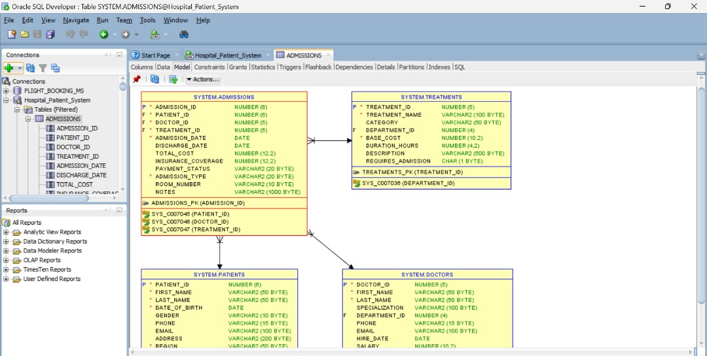
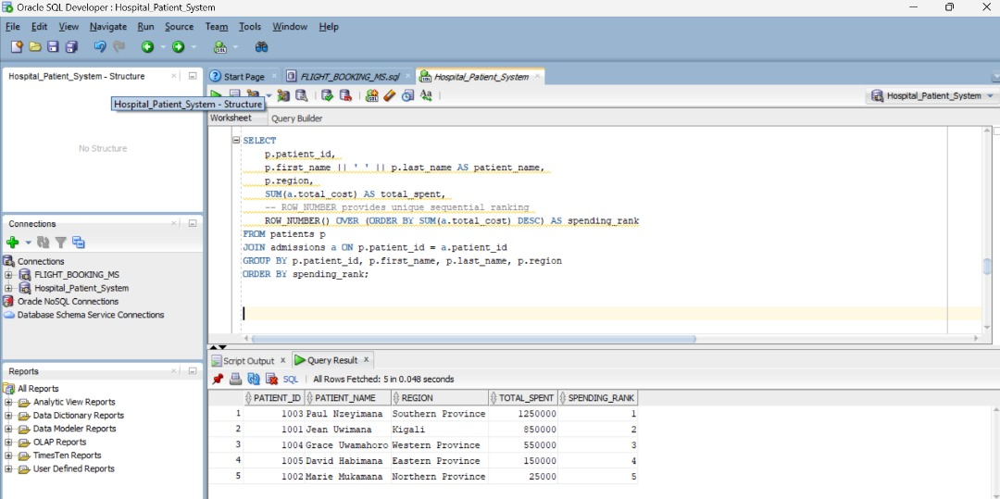
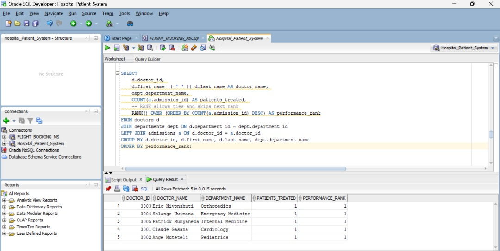
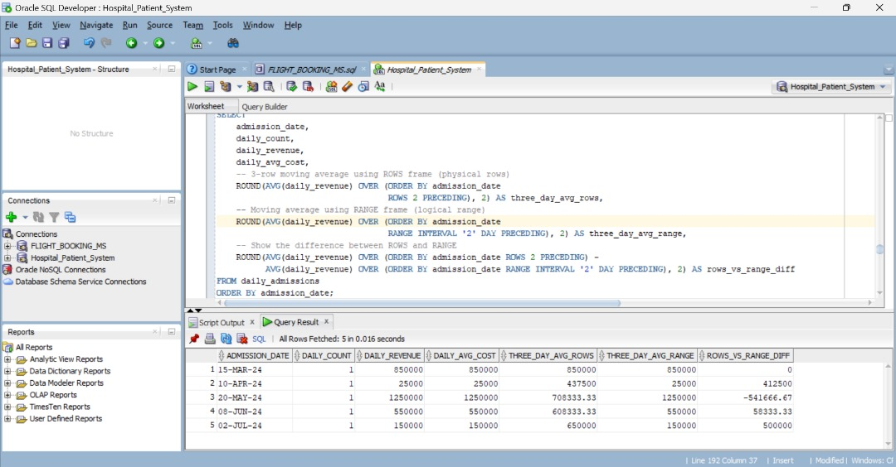
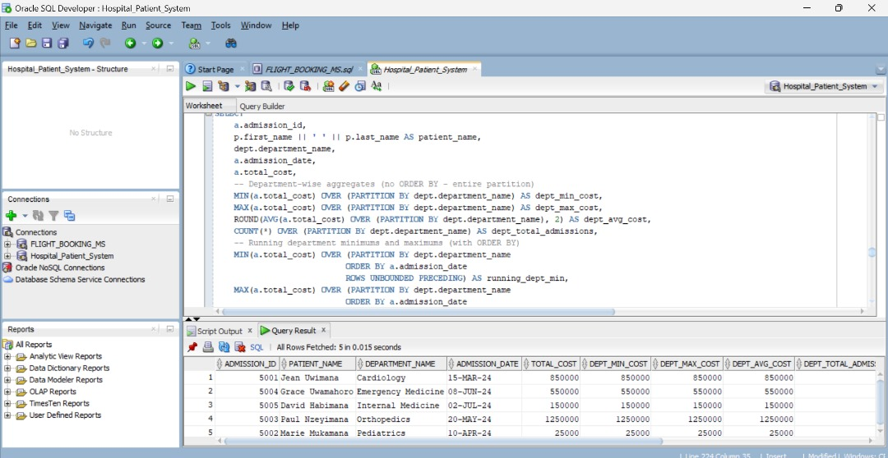
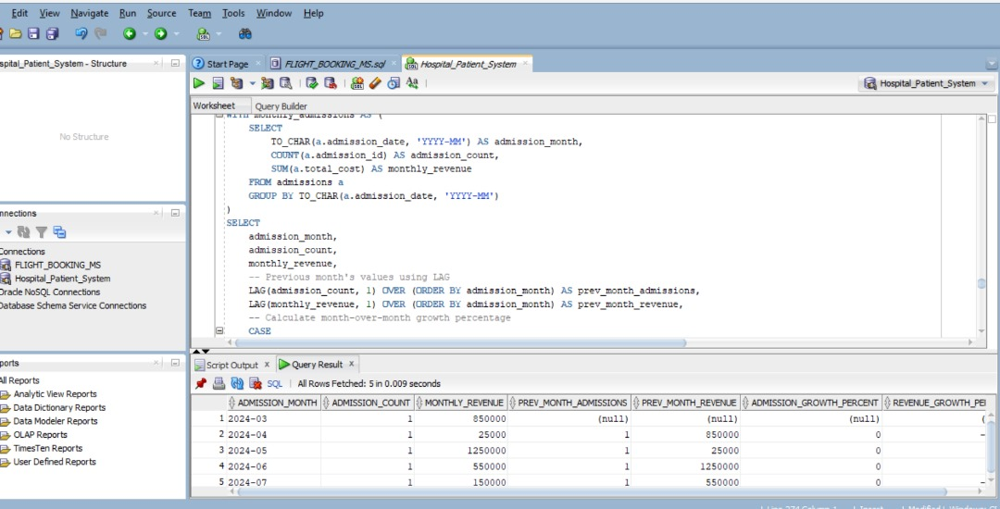

# 🏥 Hospital Patient Management System – Window Functions

👤 **Author:** Rukundo Levis  
🎓 **ID:** 27507
📚 **Course:** Database Development with PL/SQL (INSY 8311)  
📅 **Date:** September 29, 2025  

---

## 📘 Introduction
This project demonstrates the application of **PL/SQL window functions** in analyzing hospital data.  
By leveraging ranking, aggregate, navigation, and distribution functions, we answer real-world hospital management questions such as:  

- Which patients generate the highest revenue?  
- Which doctors treat the most patients per department?  
- Which treatments are the most profitable?  
- How does patient spending distribute across age groups and regions?  
- What are the monthly growth patterns for admissions and revenue?  

## Table Creation and Insertion
Here is all the table that were needed to solve the Problem, There were created well and also 
the data were inserted 

---


## 🏗️ Database Schema
The system models core entities of a hospital:  

| Table         | Key Columns | Purpose |
|---------------|-------------|---------|
| **departments** | department_id, department_name | Hospital units (Cardiology, Neurology, etc.) |
| **doctors**     | doctor_id, first_name, last_name, department_id, hire_date | Medical staff linked to departments |
| **patients**    | patient_id, first_name, last_name, region, date_of_birth | Patient demographics |
| **treatments**  | treatment_id, treatment_name, category, base_cost, department_id | Medical procedures and costs |
| **admissions**  | admission_id, patient_id, doctor_id, treatment_id, admission_date, discharge_date, total_cost | Records of hospitalizations |





## ⚙️ Window Function Queries

## 🔹 Category 1: Ranking Functions
**Use Case: Top N analysis for patients, doctors, and treatments**

##  Query  – ROW_NUMBER(): Unique patient ranking by spending  
```sql
SELECT p.patient_id, p.first_name || ' ' || p.last_name AS patient_name,
       p.region, SUM(a.total_cost) AS total_spent,
       ROW_NUMBER() OVER (ORDER BY SUM(a.total_cost) DESC) AS spending_rank
FROM patients p
JOIN admissions a ON p.patient_id = a.patient_id
GROUP BY p.patient_id, p.first_name, p.last_name, p.region
ORDER BY spending_rank;
```


## Query  – RANK(): Doctors ranked by number of patients  
```sql
SELECT d.doctor_id, d.first_name || ' ' || d.last_name AS doctor_name,
       dept.department_name, COUNT(a.admission_id) AS patients_treated,
       RANK() OVER (ORDER BY COUNT(a.admission_id) DESC) AS performance_rank
FROM doctors d
JOIN departments dept ON d.department_id = dept.department_id
LEFT JOIN admissions a ON d.doctor_id = a.doctor_id
GROUP BY d.doctor_id, d.first_name, d.last_name, dept.department_name
ORDER BY performance_rank;
```


#### Query 1.3 – DENSE_RANK(): Treatments ranked by revenue  
```sql
SELECT t.treatment_id, t.treatment_name, t.category,
       SUM(a.total_cost) AS total_revenue,
       DENSE_RANK() OVER (ORDER BY SUM(a.total_cost) DESC) AS revenue_rank
FROM treatments t
LEFT JOIN admissions a ON t.treatment_id = a.treatment_id
GROUP BY t.treatment_id, t.treatment_name, t.category
ORDER BY revenue_rank;
```


#### Query 1.4 – PERCENT_RANK(): Patient age distribution  
```sql
SELECT p.patient_id, p.first_name || ' ' || p.last_name AS patient_name,
       FLOOR(MONTHS_BETWEEN(SYSDATE, p.date_of_birth) / 12) AS age,
       p.region,
       PERCENT_RANK() OVER (ORDER BY p.date_of_birth) AS age_percentile
FROM patients p
ORDER BY age_percentile DESC;
```


---

## 🔹 Category 2: Aggregate Functions with Window Frames
**Use Case: Running totals, moving averages, and departmental trends**

## Query  – SUM() OVER(): Running total of monthly revenue  
```sql
WITH monthly_summary AS (
    SELECT TO_CHAR(a.admission_date, 'YYYY-MM') AS admission_month,
           COUNT(a.admission_id) AS monthly_admissions,
           SUM(a.total_cost) AS monthly_revenue
    FROM admissions a
    GROUP BY TO_CHAR(a.admission_date, 'YYYY-MM')
)
SELECT admission_month, monthly_admissions, monthly_revenue,
       SUM(monthly_revenue) OVER (ORDER BY admission_month ROWS UNBOUNDED PRECEDING) AS running_total_revenue,
       ROUND(AVG(monthly_revenue) OVER (ORDER BY admission_month ROWS UNBOUNDED PRECEDING), 2) AS running_avg_revenue
FROM monthly_summary
ORDER BY admission_month;
```


## Query 2.2 – AVG() OVER(): Moving averages (ROWS vs RANGE)  
```sql
WITH daily_admissions AS (
    SELECT a.admission_date, COUNT(a.admission_id) AS daily_count,
           SUM(a.total_cost) AS daily_revenue, AVG(a.total_cost) AS daily_avg_cost
    FROM admissions a
    GROUP BY a.admission_date
)
SELECT admission_date, daily_count, daily_revenue, daily_avg_cost,
       ROUND(AVG(daily_revenue) OVER (ORDER BY admission_date ROWS 2 PRECEDING), 2) AS three_day_avg_rows,
       ROUND(AVG(daily_revenue) OVER (ORDER BY admission_date RANGE INTERVAL '2' DAY PRECEDING), 2) AS three_day_avg_range,
       ROUND(AVG(daily_revenue) OVER (ORDER BY admission_date ROWS 2 PRECEDING) - 
             AVG(daily_revenue) OVER (ORDER BY admission_date RANGE INTERVAL '2' DAY PRECEDING), 2) AS rows_vs_range_diff
FROM daily_admissions
ORDER BY admission_date;
```



## Query 2.3 – MIN/MAX/COUNT OVER(): Department cost performance  
```sql
SELECT a.admission_id, p.first_name || ' ' || p.last_name AS patient_name,
       dept.department_name, a.admission_date, a.total_cost,
       MIN(a.total_cost) OVER (PARTITION BY dept.department_name) AS dept_min_cost,
       MAX(a.total_cost) OVER (PARTITION BY dept.department_name) AS dept_max_cost,
       ROUND(AVG(a.total_cost) OVER (PARTITION BY dept.department_name), 2) AS dept_avg_cost,
       COUNT(*) OVER (PARTITION BY dept.department_name) AS dept_total_admissions
FROM admissions a
JOIN patients p ON a.patient_id = p.patient_id
JOIN doctors d ON a.doctor_id = d.doctor_id
JOIN departments dept ON d.department_id = dept.department_id
ORDER BY dept.department_name, a.admission_date;
```


---

### 🔹 Category 3: Navigation Functions
**Use Case: Period-to-period comparison and trend analysis**

#### Query 3.1 – LAG(): Month-over-month growth  
```sql
WITH monthly_admissions AS (
    SELECT TO_CHAR(a.admission_date, 'YYYY-MM') AS admission_month,
           COUNT(a.admission_id) AS admission_count,
           SUM(a.total_cost) AS monthly_revenue
    FROM admissions a
    GROUP BY TO_CHAR(a.admission_date, 'YYYY-MM')
)
SELECT admission_month, admission_count, monthly_revenue,
       LAG(admission_count, 1) OVER (ORDER BY admission_month) AS prev_month_admissions,
       LAG(monthly_revenue, 1) OVER (ORDER BY admission_month) AS prev_month_revenue,
       ROUND((admission_count - LAG(admission_count, 1) OVER (ORDER BY admission_month)) * 100.0 /
             NULLIF(LAG(admission_count, 1) OVER (ORDER BY admission_month), 0), 2) AS admission_growth_percent,
       ROUND((monthly_revenue - LAG(monthly_revenue, 1) OVER (ORDER BY admission_month)) * 100.0 /
             NULLIF(LAG(monthly_revenue, 1) OVER (ORDER BY admission_month), 0), 2) AS revenue_growth_percent
FROM monthly_admissions
ORDER BY admission_month;
```



## 📌 Insights
- **Patients:** A few patients drive the majority of revenue.  
- **Doctors:** Cardiology and Surgery staff treat the most patients.  
- **Treatments:** High-cost procedures like Heart Surgery dominate revenue.  
- **Trends:** Running totals show steady financial growth.  
- **Segmentation:** Patients can be classified into **VIP, High Value, Standard, and Basic Care** categories.  

---

## 🧠 Conclusion
Window functions such as **ROW_NUMBER, RANK, DENSE_RANK, LAG, LEAD, NTILE, and CUME_DIST** provide deep analytical insights for hospital management.  
They enable:  
- Smarter **patient segmentation**,  
- Better **doctor and department evaluation**,  
- Strategic **treatment pricing**,  
- Effective **planning for admissions and capacity**.  

---

## ✅ Integrity Statement
All SQL queries and explanations are **my original work**.  
External references (Oracle documentation, tutorials, academic sources) were consulted and cited appropriately.  
No uncredited AI-generated content was copied.  
